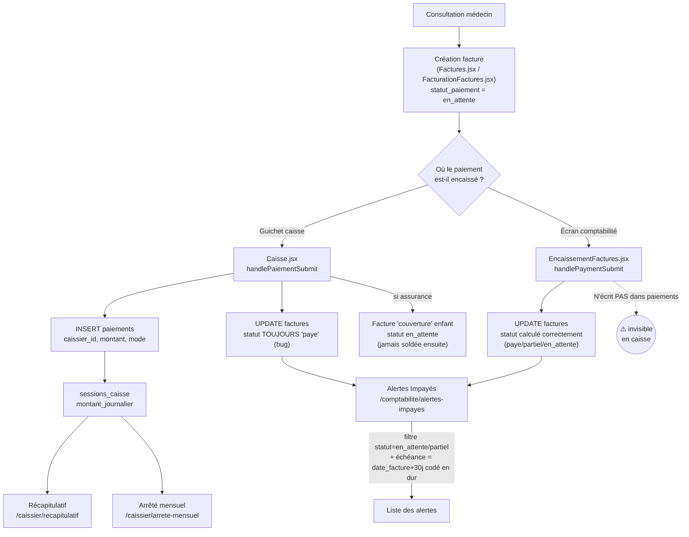

# 🧠 Dossier Brainstorm — Module Caisse & Comptabilité

> Document de travail pour discussion. Basé sur : lecture du code (`src/pages/secretary/Caisse.jsx`, `src/pages/comptabilite/*`, `src/pages/caissier/*`, `src/services/factureService.js`), les migrations SQL (`supabase/migrations/*caisse*`, `*facture*`, `*accounting*`, `*caissier*`), l'historique git, les rapports existants dans `docs/RAPPORT_*COMPTABILITE*.md`, et une navigation live sur `http://localhost:3000` (compte caissier "Moussa Fall") le 2026‑08‑05.

---

## 1. Périmètre analysé

| # | Page | Route | Rôle(s) autorisé(s) |
|---|------|-------|----------------------|
| 1 | Caisse | `/caisse` | secretary, admin, caissier |
| 2 | Encaissement des Factures | `/comptabilite/encaissement` | accounting, admin, caissier |
| 3 | Alertes Impayés | `/comptabilite/alertes-impayes` | accounting, admin, caissier |
| 4 | Récapitulatif | `/caissier/recapitulatif` | admin, caissier |
| 5 | Arrêté mensuel | `/caissier/arrete-mensuel` | admin, caissier |

Ces 5 écrans forment le **cœur du cycle "argent"** du cabinet : un patient consulte → une facture est créée → il paie au comptoir → la caisse suit ses encaissements jour/mois → le système est censé signaler qui n'a pas payé.

---

## 2. Les personas

| Persona | Rôle DB | Ce qu'il fait ici | Ce qu'il ne voit pas |
|---|---|---|---|
| **Secrétaire** | `secretary` | Ouvre/ferme la caisse, encaisse les patients à l'accueil (`/caisse`) | Alertes impayés, encaissement comptabilité, récap caissier |
| **Caissier** | `caissier` (rôle ajouté a posteriori, avril 2026) | Même chose que la secrétaire + accès aux écrans dédiés `/caissier/*` (relances, récapitulatif, arrêté mensuel, reversement bancaire) + accès à l'encaissement comptabilité et aux alertes impayés | Rapports financiers, tableau de bord comptable, recherche avancée (réservés `accounting`) |
| **Comptable** | `accounting` (rôle ajouté janvier 2026) | Encaissement, alertes impayés, suivi des caissiers, tableau de bord, rapports, recherche avancée | La page `/caisse` elle‑même (bizarrerie, voir §6.5) |
| **Admin** | `admin` | Accès total à tout le périmètre + gestion des comptes caissiers/comptables | — |
| **Médecin** | `doctor` | Aucun accès direct à ce module — génère en amont les actes qui deviennent des lignes de facture | Tout le module caisse/comptabilité |
| **Patient** | — | Sujet passif : reçoit la facture/le reçu imprimé, et en théorie une relance email/SMS s'il ne paie pas | N'a pas de compte dans l'app |

**Observation** : deux rôles (`accounting` et `caissier`) ont été créés à ~3 mois d'intervalle (`20260121000000_add_accounting_role.sql` puis `20260123000001_add_caissiers.sql`), avec des **périmètres qui se chevauchent partiellement** (les deux ont accès à `/comptabilite/encaissement` et `/comptabilite/alertes-impayes`) sans qu'il soit évident, à la lecture du code, quelle différence métier justifie que l'un ait accès à `/caisse` et pas l'autre. À clarifier : est-ce voulu (le comptable ne doit jamais manipuler du cash physique) ou un oubli ?

---

## 3. Le flux de bout en bout

Deux points de friction structurels ressortent tout de suite de ce diagramme :

1. **Deux guichets d'encaissement indépendants** (Caisse.jsx et EncaissementFactures.jsx) avec des règles différentes et des effets de bord différents.
2. **La caisse (source la plus utilisée en pratique) casse la donnée qui alimente les alertes impayés.**

---

## 4. Logique détaillée par écran

### 4.1 `/caisse` — `Caisse.jsx` (2 478 lignes, le plus gros fichier du périmètre)

**Rôle** : poste de travail quotidien du caissier/secrétaire.

- **Ouverture de caisse** : saisie d'un fond de caisse initial → `INSERT sessions_caisse`. Une seule session ouverte par jour et par caissier (contrainte DB).
- **Tableau de bord caisse en direct** : fond de caisse, total encaissé aujourd'hui, solde actuel (fond + jour), total du mois, répartition par mode de paiement (espèces/carte/chèque/mobile money…). Mis à jour en **temps réel** via un canal Supabase Realtime sur la table `paiements`, avec un `setInterval` de secours toutes les 45 s.
- **Recherche de facture** à encaisser (nom, prénom, n° facture) parmi les factures non soldées.
- **Encaissement d'une facture** (`handlePaiementSubmit`) :
  1. Bloque si aucune session de caisse n'est ouverte.
  2. Calcule la répartition patient / assurance si le patient a une couverture (`taux_remboursement`).
  3. Met à jour la facture patient — **`statut_paiement` est toujours écrit `'paye'`**, peu importe le montant réellement réglé.
  4. Si couverture : crée une **seconde facture "enfant"** (`type='couverture'`, `facture_parent_id`) représentant la créance envers l'assureur/IPM/mutuelle, statut `en_attente`.
  5. Insère la ligne dans `paiements` (celle-ci alimente tout le reste : récap, arrêté, suivi caissiers).
  6. Notifie la secrétaire, imprime un reçu (fenêtre HTML générée à la volée).
- **Fermeture de caisse** : RPC `fermer_session_caisse` qui calcule le total réel du jour côté SQL et clôture la session.
- **Historiques** "par patient" / "par couverture" avec export CSV.
- **Mode "supervision"** caché pour `role === 'accounting'`/`'admin'` — mais la route `/caisse` n'autorise pas `accounting`, donc ce bloc de code ne peut jamais s'exécuter en pratique.

### 4.2 `/comptabilite/encaissement` — `EncaissementFactures.jsx`

**Rôle** : "deuxième guichet" pensé pour la comptabilité (mais aussi accessible aux caissiers).

- KPI : total factures, chiffre d'affaires, encaissé, reste à encaisser, factures payées.
- Filtre par statut (à encaisser / payées / tout) et par période.
- **Encaissement** (`handlePaymentSubmit`) : supporte encaissement **et décaissement** (correction, montant négatif). Le nouveau statut est calculé correctement :
  `paye` si `montant_paye ≥ montant_ttc`, `partiel` si `> 0`, sinon `en_attente`.
- **Ne crée aucune ligne dans `paiements`** → un encaissement fait ici est **invisible** dans la caisse du jour, le suivi des caissiers et l'arrêté mensuel.
- Données de démo codées en dur si la table est vide (fallback avec `id: 999/998`), ce qui peut prêter à confusion en environnement réel peu peuplé.

### 4.3 `/comptabilite/alertes-impayes` — `AlertesImpayes.jsx`

**Rôle** : censé être le radar des impayés du cabinet.

- Requête `factures` où `statut_paiement IN (en_attente, partiel)`, hors factures "couverture" enfants.
- **Échéance = `date_facture + 30 jours`**, codée en dur (aucune colonne `date_echeance` en base, aucun paramétrage réel).
- **Sévérité** : `> 60j` = critique, `> 30j` = élevé, sinon = moyen (le niveau "faible" existe visuellement mais n'est jamais atteint par le calcul).
- Boutons "Envoyer rappel email/SMS", "Marquer résolu", "Exporter" : **aucun n'a d'effet réel** — `console.log` / `alert()` / mise à jour du seul state React local (perdue au rechargement).
- Le bouton "Configuration des alertes" (seuil de jours, fréquence, canaux) **ne sauvegarde rien** — la modale que j'ai ouverte en live le confirme : seuil affiché "30 jours", mais rien n'est persisté en base ni utilisé ailleurs que dans ce state local.
- Le filtre "Statut" (actif/résolu) du haut de page est déclaré mais **jamais appliqué** à la liste — bug silencieux.

### 4.4 `/caissier/recapitulatif` — `Recapitulatif.jsx`

**Rôle** : vue de gestion pour le caissier — reste à payer par patient / par couverture, génération de "factures" récapitulatives imprimables (globales, par patient, par couverture) sur une période choisie (jour/mois/période libre).

- Couverture "effective" = celle de la facture si renseignée, sinon celle du patient (fallback en cascade).
- Génère un HTML imprimable groupé par patient ou par assureur, avec totaux.
- **C'est cet écran qui m'a permis de repérer le bug** (voir §6) : il affiche un statut "paye" sur des lignes dont le "Reste" est pourtant > 0.

### 4.5 `/caissier/arrete-mensuel` — `ArreteMensuel.jsx`

**Rôle** : clôture comptable mensuelle — une ligne par session de caisse (jour), avec fond de caisse, encaissements du jour, solde final, caissier, statut ouverte/fermée. Appelle le RPC SQL `get_arrete_comptable_mensuel(annee, mois)`. Bouton "Imprimer" (impression navigateur directe du tableau).

---

## 5. Ce que j'ai observé en live (bug confirmé, pas juste théorique)

En me connectant avec le compte caissier de test, `/caissier/recapitulatif` affiche, pour aujourd'hui :

| Facture | Patient | TTC | Payé | **Reste** | **Statut affiché** |
|---|---|---|---|---|---|
| FAC-1785932191615 | Anna Diao | 36 000 | 25 200 | **10 800** | `paye` ⚠️ |
| FAC-1785926115915 | SALIMATA AGNE | 36 000 | 7 200 | **28 800** | `paye` ⚠️ |
| FAC-1785721057622 | SALIMATA AGNE | 106 000 | 21 200 | **84 800** | `paye` ⚠️ |
| FAC-1785761364929 | Aminata Cabral | 55 900 | 16 770 | **39 130** | `paye` ⚠️ |

Total réellement impayé sur ces factures **partielles** : **163 530 F CFA**, réparti sur 3 patients et 3 assureurs (Harmonie Mutuelle, AXA Santé, Crédit Agricole).

Pourtant :
- **`/caissier/relances`** → *"Aucun patient avec facture impayée ou partielle."*
- **`/comptabilite/alertes-impayes`** → **Total Alertes: 0**, **Montant Total: 0 FCFA**.

**Cause racine confirmée dans le code** : `Caisse.jsx::handlePaiementSubmit` écrit systématiquement `statut_paiement: 'paye'` quand le patient encaisse au guichet, **même si le montant payé est inférieur au montant total** (cas fréquent : le patient règle sa part, l'assurance doit régler le reste via la facture "couverture" séparée). Les deux écrans qui filtrent sur `statut_paiement IN (en_attente, partiel)` (Relances et Alertes Impayés) ne voient donc **jamais** ces factures, alors que `montant_restant` (colonne calculée par Postgres) est bien > 0.

**Conséquence métier concrète** : le module "Alertes Impayés", censé être *the* outil de suivi des impayés du cabinet, est **structurellement aveugle** à la catégorie de créance la plus courante dans un cabinet qui travaille avec des assurances/IPM/mutuelles — le paiement partiel patient-en-attendant-l'assureur. Le comptable et le caissier n'ont aujourd'hui **aucun moyen fiable** de savoir, depuis ces écrans, qui doit encore de l'argent au cabinet dès qu'un paiement partiel est passé par la caisse.

---

## 6. Historique : comment on en est arrivé là

### Chronologie reconstituée (git + docs existants)

| Date | Évènement |
|---|---|
| 2026‑01‑22 | Rôle `accounting` créé (`RAPPORT_CREATION_ROLE_COMPTABILITE.md`) : plan ambitieux avec dashboard, sidebar en 7 sections (Facturation, Relances & Suivi, Exports, Rapports, TVA, Configuration), pages prévues `RelancesPage`, `AgingPage`, `EncaissementsPage`, `ModesPaiementPage`, `ComptesBancairesPage`, `ExercicesPage` |
| 2026‑01‑23 | Tables `paiements`, `sessions_caisse` créées (`caisse_paiements_factures.sql`, `sessions_caisse.sql`) |
| 2026‑01‑23 | Rôle `caissier` créé (`add_caissiers.sql`) + `reversements_bancaires` + sessions isolées par caissier |
| 2026‑04‑09 | *"first commit"* — le dépôt git actuel démarre avec l'essentiel du schéma déjà présent (donc l'historique git ne remonte pas à la genèse réelle du module ; les dates de migration ci-dessus sont antérieures à git) |
| 2026‑04‑24 | *"notifications multi-tenancy et role caissier, numero dossier automatique, affichage cabinet sur factures"* — le rôle caissier est câblé dans l'app |
| 2026‑05‑06 → 05‑19 | Nombreux commits sur RDV/salle d'attente ; peu de mouvement sur caisse/comptabilité |
| 2026‑05‑15 | *"mise à jour gestion patients et comptabilité"* — dernière vraie évolution fonctionnelle du module avant août |
| 2026‑08‑04 | Dernier commit touchant ces fichiers (`5f43bdf`) : **refactor de formatage des devises** (`utils/currency.js`) sur 43 fichiers, y compris les 5 pages analysées — aucun changement de logique métier, juste l'affichage "F CFA" |

### L'écart plan vs réalité

Les rapports `docs/RAPPORT_MODULE_COMPTABILITE.md` et `docs/RAPPORT_CREATION_ROLE_COMPTABILITE.md` décrivent un plan très structuré (sidebar en 7 sections, pages `RelancesPage.jsx`, `AgingPage.jsx`, `ModesPaiementPage.jsx`, `ComptesBancairesPage.jsx`, `ExercicesPage.jsx`, statuts uniformisés `payee/impayee/partiellement_payee`, module `invoices`…). **Rien de tout ça n'existe dans le code actuel** :
- Les statuts réels en base sont `en_attente/partiel/paye/impaye` (pas `payee/impayee/partiellement_payee` du plan) — et `FacturationFactures.jsx` a justement un bug d'affichage de statut à cause de cette confusion entre les deux nomenclatures (documenté par l'agent d'exploration).
- Il n'y a jamais eu de table `invoices` — seulement `factures`. Des policies RLS orphelines sur `invoices` traînent encore dans les migrations.
- À la place des pages prévues, on a fini avec : `AlertesImpayes.jsx` (comptabilité) **et** `Relances.jsx` (caissier) qui font presque la même chose en double, `Recapitulatif.jsx` qui fait à la fois le rôle de "aging" et de "récap patient/couverture" prévus séparément, et `ArreteMensuel.jsx` qui correspond à peu près à `ExercicesPage` du plan mais en version simplifiée.

**Lecture probable** : le module a été conçu en une fois de façon assez complète sur le papier (janvier 2026), puis développé par itérations rapides et pragmatiques par plusieurs contributeurs (`git log` montre plusieurs auteurs/branches `dev`/`main` fusionnées), sans revenir mettre à jour le plan ni consolider la logique entre les écrans qui se sont accumulés. Le bug de statut forcé "paye" dans `Caisse.jsx` n'a jamais été touché depuis — c'est un bug latent, jamais détecté faute d'outil qui croise réellement "reste à payer" et "statut affiché" (ce que j'ai fait en comparant Récapitulatif et Alertes Impayés côte à côte).

---

## 7. Synthèse des points de friction sur ce périmètre (5 écrans)

1. 🔴 **Bug critique confirmé** : `Caisse.jsx` force `statut_paiement='paye'` sur paiement partiel → Alertes Impayés et Relances ne voient jamais ces créances.
2. 🔴 **Deux guichets d'encaissement non synchronisés** : `EncaissementFactures.jsx` (comptabilité) n'écrit rien dans `paiements`, donc invisible en caisse/récap/arrêté.
3. 🟠 **Échéance et seuils codés en dur** (30/60 jours) dans `AlertesImpayes.jsx`, la "Configuration" de la page ne sert à rien (rien n'est persisté).
4. 🟠 **Duplication** `AlertesImpayes.jsx` (comptabilité) / `Relances.jsx` (caissier) : même requête, deux implémentations, deux endroits à corriger si on répare le bug.
5. 🟠 **Relances email/SMS = façade** dans les deux écrans (juste un `setTimeout` simulé, TODO explicite dans le code).
6. 🟡 **Facture "couverture" (assurance) jamais soldée** : créée en `en_attente` au moment du paiement patient, aucun écran ne permet de la faire passer à `paye` quand l'assureur règle réellement.
7. 🟡 **`/caisse` inaccessible au rôle `accounting`** alors qu'un code de "supervision comptable" existe dans le fichier — mort en pratique.
8. 🟡 **RLS très permissif** sur `paiements`/`sessions_caisse` (`auth.role() = 'authenticated'`) : l'isolement "un caissier ne voit que ses paiements" n'existe que côté application, pas en base.

---

## 8. Sujets à trancher ensemble

1. **Priorité** : corrige-t-on d'abord le bug de statut (impact direct sur la fiabilité des impayés), ou est-ce que la logique "paiement partiel = paye" est en fait *voulue* dans un cas que je n'ai pas identifié (ex. la facture patient est considérée soldée dès que le patient a payé sa part, et seule la facture "couverture" enfant devrait être suivie comme impayée) ? → à vérifier avec vous avant de toucher au code.
2. **Fusion ou suppression** d'un des deux écrans de relance (comptabilité vs caissier) ?
3. **Faut-il unifier les deux guichets d'encaissement** (Caisse vs Encaissement comptabilité), ou est-ce voulu qu'ils servent des usages différents (un pour le cash physique, l'autre pour des corrections comptables a posteriori) ? Si les deux doivent coexister, il faut au minimum qu'ils écrivent tous les deux dans `paiements`.
4. **Échéance de paiement** : ajouter une vraie colonne `date_echeance` en base (configurable par facture ou par défaut cabinet) plutôt que 30 jours codés en dur ?
5. **Relances email/SMS** : les brancher réellement (edge function + provider SMS/email), ou retirer ces boutons tant que ce n'est pas prêt (pour ne pas donner une fausse impression de fonctionnalité) ?
6. **Suivi de la part assurance** : faut-il un écran de réconciliation dédié pour faire passer les factures "couverture" à `paye` quand l'assureur rembourse ?
7. **RLS `paiements`/`sessions_caisse`** : faut-il restreindre par rôle/caissier au niveau base, pas seulement côté application ?

---

*Document généré le 2026‑08‑05 à partir d'une analyse de code + navigation live. Prêt à en discuter point par point.*
