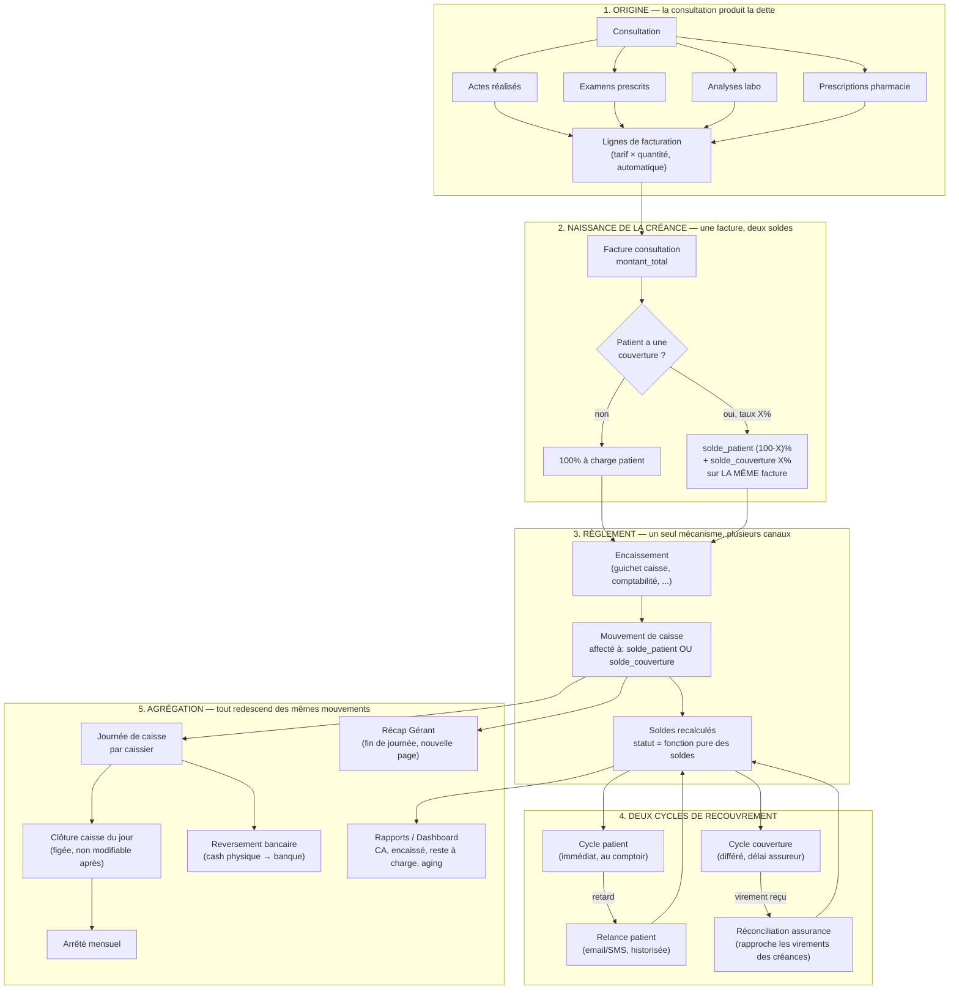
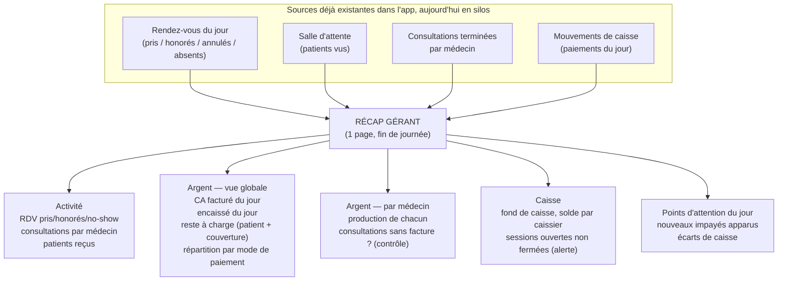

# Plan — Flux cible Caisse & Comptabilité

> Ce document décrit le flux **cible** (comment le module devrait fonctionner), issu d'une session de brainstorm le 2026‑08‑05. Il ne décrit pas l'existant — pour ça voir [`docs/BRAINSTORM_MODULE_CAISSE_COMPTABILITE.md`](../BRAINSTORM_MODULE_CAISSE_COMPTABILITE.md) (audit de l'état actuel, bugs confirmés, dette technique). Ce plan part du principe qu'on oublie l'implémentation actuelle et qu'on redéfinit comment ça devrait s'articuler, à partir des éléments qui existent déjà dans l'app (consultations, actes, examens, labo, pharmacie, assurances, RDV, salle d'attente, rôles).

---

## 1. Principe directeur

> **Un seul pipeline continu. Chaque écran est une vue sur une même source de vérité — jamais une logique indépendante.**

Le problème de fond identifié dans l'audit : chaque page (`Caisse.jsx`, `EncaissementFactures.jsx`, `AlertesImpayes.jsx`, `Relances.jsx`, `Recapitulatif.jsx`…) réimplémente sa propre requête, son propre calcul de statut, sa propre façon d'encaisser. Le flux cible élimine cette duplication en posant trois règles non négociables :

1. **Le statut n'est jamais choisi, il est calculé.** `paye` / `partiel` / `en_attente` sort d'une seule fonction pure appliquée aux soldes — jamais écrit "en dur" par un écran.
2. **Encaisser est un geste unique**, peu importe le canal (guichet caisse, comptabilité, futur portail patient). Tous les canaux alimentent le même flux de mouvements.
3. **"Impayé" n'est pas un module séparé, c'est un filtre** sur la même donnée de créances — pas une requête réécrite à chaque endroit qui en a besoin.

---

## 2. Le pipeline complet

---

## 3. Détail par étape

### 3.1 Origine de la créance

Rien ne devrait se facturer "à la main". La facture naît automatiquement de ce qui a été produit en consultation — actes, examens, analyses labo, pharmacie (tables déjà existantes dans l'app). Le caissier/comptable **encaisse** ce qui a été produit, il ne **ressaisit** rien. Ça élimine la double logique de création/numérotation de facture repérée dans l'audit.

> **Constat terrain (parcours rejoué sur `ConsultationCompletion.jsx`)** : dans l'existant, ce principe est déjà vrai pour les **actes** (tarifés via `tarifs_actes`) mais pas pour la **consultation elle-même** — son prix est un champ libre que la secrétaire retape à la main à chaque facture, valeur par défaut 0. Aucune table ne stocke ce tarif nulle part dans l'app.
> **Fait métier confirmé** : le tarif de consultation standard est de **6 000 F CFA pour un dentiste** (cabinet actuel = Cabinet Dentaire Dakar Centre).
> **Implication pour le flux cible** : la consultation doit avoir son propre tarif par défaut — probablement par spécialité, sur le même modèle que `tarifs_actes` — plutôt qu'un champ libre resaisi à chaque fois. La secrétaire pourrait garder la main pour l'ajuster au cas par cas (consultation plus longue, tarif préférentiel...), mais avec une valeur pré-remplie plutôt que 0.

### 3.2 Naissance de la créance — une facture, deux soldes

Une facture = une dette avec **deux créanciers** : le patient et éventuellement sa couverture (assurance/IPM/mutuelle), calculés dès la création via le taux de remboursement (déjà en base sur `assurances`). Une facture n'est "payée" que si les **deux** soldes sont à zéro — pas de facture "enfant" séparée qui se désynchronise de la facture "parente".

### 3.3 Règlement — un seul mécanisme

Que ce soit au guichet (secrétaire/caissier) ou en comptabilité (correction a posteriori), l'encaissement passe par **une seule fonction** : elle enregistre un mouvement, l'affecte au bon solde (patient ou couverture), et ne décide jamais elle-même du statut final — celui-ci est toujours recalculé à la lecture à partir des soldes. Tous les canaux d'encaissement écrivent dans le **même** flux de mouvements, pour que rien ne soit invisible en caisse.

### 3.4 Deux cycles de recouvrement distincts

- **Cycle patient** : recouvrement immédiat, relance classique (email/SMS) si le solde patient reste ouvert après échéance. Chaque relance envoyée est historisée (date, canal, résultat) — pas un bouton qui ne fait rien.
- **Cycle couverture** : recouvrement différé, délai contractuel propre à l'assureur. Se solde par une **réconciliation** : quand l'assureur vire de l'argent, on le rapproche des créances couverture en attente et ça ferme les soldes correspondants. C'est le maillon qui n'existe nulle part aujourd'hui et qui explique pourquoi les créances assurance restent bloquées "en attente" indéfiniment dans l'existant.

### 3.5 Agrégations — vues de synthèse, rien de nouveau stocké

Toutes les vues ci-dessous **lisent** le même flux de mouvements, elles n'ont pas leur propre logique de calcul :

| Vue | Portée | Alimentée par |
|---|---|---|
| **Journée de caisse** | Par caissier, au jour le jour | Mouvements du jour |
| **Récap Gérant** *(nouvelle page)* | Vue globale cabinet + par médecin, fin de journée | Mouvements du jour + activité (RDV, salle d'attente, consultations) |
| **Arrêté mensuel** | Somme des journées de caisse clôturées | Journées de caisse figées |
| **Reversement bancaire** | Versement du cash physique en banque | Journées de caisse |
| **Rapports / Dashboard** | CA, encaissé, reste à charge, aging | Soldes des factures |

---

## 4. Le Récap Gérant — fin de journée (nouvelle page)

Une page dédiée pour le rôle **admin/gérant** (lecture possible pour `accounting`), distincte de la caisse et de la compta — elle ne réinvente rien, elle **assemble** ce que les autres modules produisent déjà :

**Décision actée** : nouvelle page dédiée (pas une fusion avec le `TableauBordComptable.jsx` actuel, aujourd'hui entièrement mocké).

---

## 5. Rôles et accès sur le flux cible

| Rôle | Accès |
|---|---|
| **Admin / Gérant** | Tout, y compris le Récap Gérant journalier |
| **Comptable (accounting)** | Encaissement, suivi des créances (patient + couverture), réconciliation assurance, rapports. Lecture possible du Récap Gérant |
| **Caissier / Secrétaire** | Encaissement au guichet, sa propre journée de caisse. Pas d'accès au Récap Gérant (pas son échelle de responsabilité) |
| **Médecin** | Pas d'accès au module — reste en amont (production d'actes) |

---

## 6. Parcours rejoué — ce que le terrain a corrigé ou confirmé

Rejouer le parcours réel d'un patient (accueil → consultation → facturation → encaissement) a validé une partie du plan et corrigé une hypothèse :

- **Confirmé** : le bug de statut (`Caisse.jsx` force `'paye'` même en paiement partiel) est bien à la source unique du problème — retracé jusqu'à la ligne exacte de `handlePaiementSubmit`.
- **Corrigé** : on avait supposé que la facture naît *automatiquement* à la fin de la consultation. En réalité, elle naît d'un **clic humain de la secrétaire** sur un écran dédié (`ConsultationCompletion.jsx`), qui resaisit même le prix de la consultation à la main (voir §3.1). Le principe cible ("rien ne se facture à la main") reste valable, mais implique de fiabiliser cette étape plutôt que de supposer qu'elle est déjà automatique.
- **Découvert** : un troisième format de numérotation de facture (`FAC-<timestamp>`), en plus des deux déjà repérés dans l'audit — trois écrans différents numérotent chacun à leur façon.

---

## 7. Idées de refonte — logique métier

Punch-list actionnable, dérivée des principes (§1) et du parcours rejoué (§6) :

1. **Statut toujours dérivé, jamais écrit en dur** — remplacer les `statut_paiement: 'paye'` codés en dur (notamment dans `Caisse.jsx::handlePaiementSubmit`) par un calcul systématique à partir des soldes.
2. **Un seul mécanisme d'encaissement**, appelé par tous les canaux (guichet, comptabilité) — actuellement deux implémentations indépendantes avec des effets de bord différents.
3. **Vérification de session de caisse déplacée en amont** — bloquer/désactiver la recherche et la sélection de facture si aucune session n'est ouverte, plutôt que de laisser l'utilisateur remplir tout le formulaire avant de le découvrir.
4. **Tarif de consultation par défaut, configurable** (ex. par spécialité, sur le modèle de `tarifs_actes`) — remplace le champ libre à 0 resaisi à la main (fait métier : 6 000 F CFA pour un dentiste).
5. **Un seul format de numérotation de facture**, porté par la base (trigger), plus par trois écrans différents.
6. **Réconciliation assurance** comme maillon explicite (voir §3.4) — aujourd'hui inexistant, les créances couverture ne se ferment jamais.

---

## 8. Idées de refonte — écrans / ergonomie (Caisse & satellites)

Issues d'un audit ergonomique du parcours caissier sur `Caisse.jsx` (voir aussi le prompt de refonte visuelle, [`PROMPT_REFONTE_ECRANS_CAISSE.md`](./PROMPT_REFONTE_ECRANS_CAISSE.md)) :

| # | Problème observé | Direction de refonte |
|---|---|---|
| 1 | Le blocage "caisse fermée" n'apparaît qu'au tout dernier clic (soumission), après recherche + sélection + saisie complète | Désactiver la recherche/sélection de facture dès l'entrée sur la page si aucune session n'est ouverte, + bandeau permanent |
| 2 | Rien ne signale un paiement partiel pendant la saisie | Afficher en temps réel "reste après ce paiement : X F CFA" dans le formulaire, avec un libellé explicite si le solde ne sera pas soldé |
| 3 | "Mise à jour caisse" / "Fermer la caisse" / "Arrêté mensuel" ont le même poids visuel malgré des fréquences très différentes (quotidien × plusieurs / quotidien × 1 / mensuel × 1) | Hiérarchiser visuellement par fréquence et par gravité |
| 4 | Le bouton rapide "Fermer la caisse" contourne la vérification recommandée par le panneau "Fin de journée" | Rendre la vérification obligatoire avant fermeture, ou au moins une confirmation explicite si elle est sautée |
| 5 | Une seule page cumule encaissement + historiques + supervision (partiellement morte) + fin de journée + arrêté mensuel — 2 478 lignes | Séparer en vues/onglets : Encaisser · Historique du jour · Fin de journée — réduire le bruit visuel autour de la tâche la plus fréquente |
| 6 | Le reçu imprimé passe par `window.open` + `setTimeout`, sans repli si bloqué par le navigateur (le code lui-même documente l'instabilité) | Fiabiliser la génération (PDF téléchargeable) avec repli visible en cas d'échec |
| 7 | "Total journée" et "Ce mois" affichés avec le même poids visuel dans la même grille de cartes | Différencier clairement les échelles de temps (couleur, taille, regroupement) |
| 8 | Sur `Récapitulatif.jsx` : une ligne peut afficher "payé" avec un "Reste" positif juste à côté, sans aucune mise en évidence de la contradiction | Signal visuel de sécurité (icône/couleur d'alerte) tant que le modèle de données n'est pas corrigé côté logique |

---

## 9. Points encore ouverts

- Modalités précises de la **réconciliation assurance** (import de relevé bancaire ? saisie manuelle par virement reçu ? rapprochement automatique par référence ?) — à approfondir.
- Échéance de règlement : configurable par facture, par type de couverture, ou un seul délai cabinet par défaut ?
- Le Récap Gérant doit-il comparer le jour à une référence (veille, moyenne glissante) ou rester une photo brute du jour ?
- Historisation des relances : faut-il un canal réel (email/SMS via un provider) dès la V1, ou une trace "à faire manuellement" suffit pour commencer ?

---

## 10. Prochaines étapes suggérées

Ce document est un plan de **conception**, pas un plan d'implémentation. Avant de coder quoi que ce soit :
1. Valider ensemble le modèle "une facture, deux soldes" (impact migration DB sur les factures "couverture" existantes).
2. Prioriser : quel maillon manquant a le plus de valeur à combler en premier (réconciliation assurance ? Récap Gérant ? unification des deux guichets d'encaissement ?).
3. Découper en lots livrables plutôt qu'une refonte big-bang.
4. Lancer la refonte visuelle des écrans caisse à partir du prompt dédié ([`PROMPT_REFONTE_ECRANS_CAISSE.md`](./PROMPT_REFONTE_ECRANS_CAISSE.md)).

---

*Document créé le 2026‑08‑05, à partir de la session de brainstorm avec l'utilisateur.*
